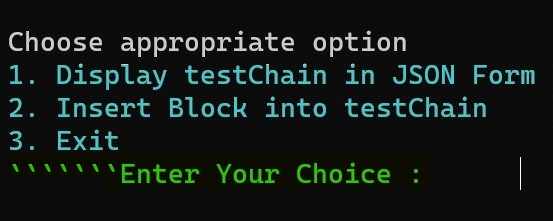
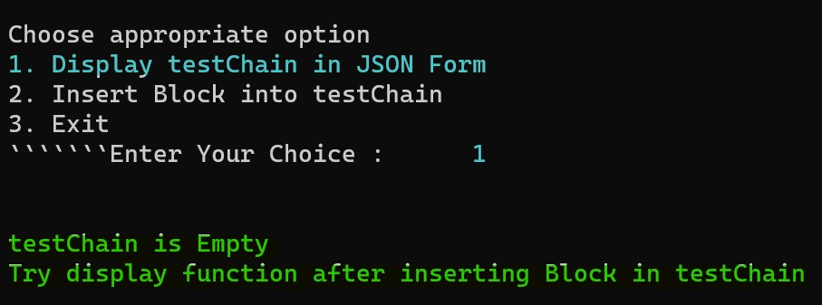
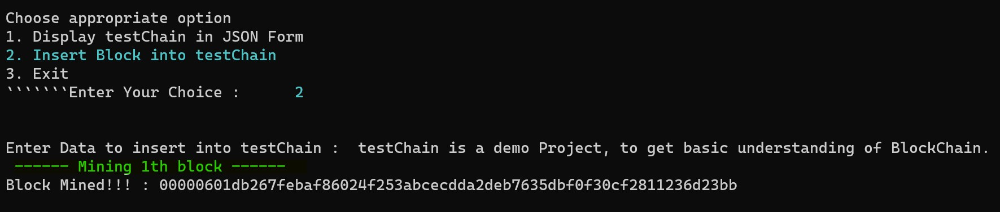
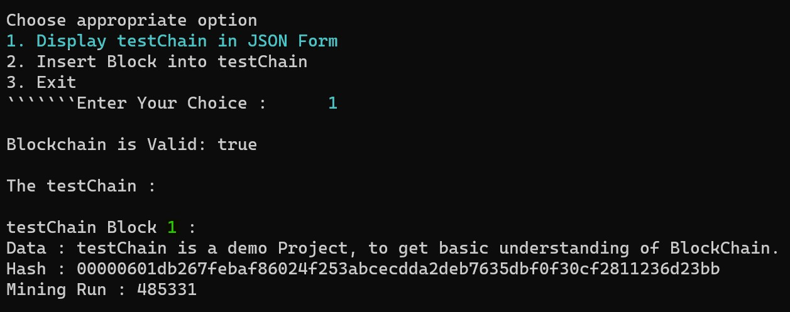
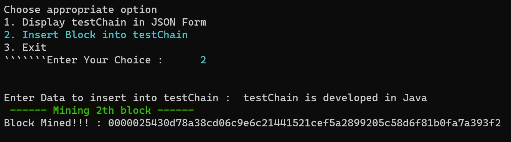
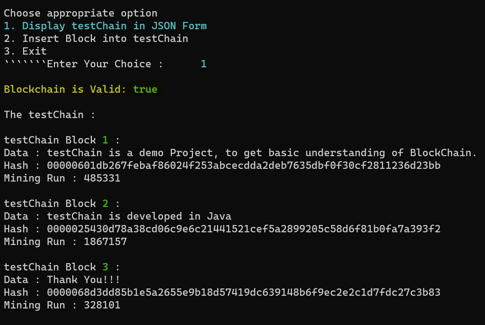
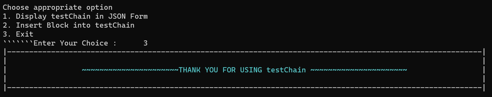

# Project testChain 
Project TestChain can provide a basic understanding of BlockChain.
 

 

## Index
>1. [Description](https://github.com/malivinayak/testChain/tree/main#description-)
>2. [Project Working](https://github.com/malivinayak/testChain/tree/main#project-working-%EF%B8%8F)
>3. [Requirements](https://github.com/malivinayak/testChain/tree/main#requirements-)
>4. [Installation](https://github.com/malivinayak/testChain/tree/main#installation-)
>5. [Project Files](https://github.com/malivinayak/testChain/tree/main#project-files-)
>6. [Compiled .class files](https://github.com/malivinayak/testChain/tree/main#compiled-class-files-)
>7. [Contributing](https://github.com/malivinayak/testChain/tree/main#contributing-)
>8. [Thank You!](https://github.com/malivinayak/testChain/tree/main#thank-you)

## Description 📃
testChain is a basic demo of Blockchain.  This project is developed to get a basic idea of the workings of Blockchain

testChain is developed with ``Java`` , ``SHA256`` Cryptographic algorithm and ``Mining of Blocks`` concept. 

There are mainly 2 options to showcase the basic functions of a blockchain : 

 >1. Display the Blockchain
 >
 >2. Insert a block into testChain ( Mine new Block )

 
 
 #### 1. Display the Blockchain

The display function will display all blocks in testChain with securely stored data, its hash and mining run (iteration counter of mine block to get specific hash ). 

Before displaying testChain, all blocks must undergo 3 authentication checks (i.e. isChainValid function) : 

   > a. registered hash and calculated hash must matched
   >
   >b. previous hash and registered previous hash must matched
   >
   >c. check if hash is solved or mining is completed

 

 #### 2. Insert a block into testChain ( Mine new Block )

For mining of new block or insertion of block in testChain, data is taken from user. For Calculating Hash value SHA-256 Algorithm is applied on String containing previousHash, timeStamp i.e. minning start time in millisecond, data and miner. Block was mined by setting difficulty level 5 (It can be changed).

 

## Project Working 🕹️
>1. Project testChain
>
>

>2. Options
>
>

> 3. Displaing Empty testChain
>
>

> 4. Adding 1st Block
>
> 

> 5. Displaying testChain
>
> 

> 6. Adding next Block
>
> 

> 7. Adding next Block
>
> 

> 8. Displaying testChain
>
> 

> 9. Exit
>
> 

## Requirements 🔧
 Java version 8 or higher
 
   
## Installation 🔌
1. Press the **Fork** button (top right the page) to save copy of this project on your account.

2. Download the repository files (project) from the download section or clone this project by typing in the bash the following command:

       https://github.com/malivinayak/testChain.git
       
3. Imported it in Intellij IDEA or any other Java IDE.
4. You can compile directly in command line or terminal too.
5. Run the application :D
6. Alternativly [download](https://github.com/malivinayak/testChain#compiled-class-files-) 
[.class](https://github.com/malivinayak/testChain/tree/main/class%20files) files and directly run in Command Prompt or Terminal.

## Project files 📂
   - [testChain.java](https://github.com/malivinayak/testChain/blob/main/testChain.java)
   - [Block.java](https://github.com/malivinayak/testChain/blob/main/Block.java)
   - [StringUtil.java](https://github.com/malivinayak/testChain/blob/main/StringUtil.java)
 

## Compiled .class files 📂
>- [x] [testChain⏬](https://github.com/malivinayak/testChain/raw/main/class%20files/testChain.class)
>- [x] [Block⏬](https://github.com/malivinayak/testChain/raw/main/class%20files/Block.class)
>- [x] [StringUtil⏬](https://github.com/malivinayak/testChain/raw/main/class%20files/StringUtil.class)

## Contributing 💡
If you want to contribute to this project and make it better with new ideas, your pull request is very welcomed.
If you find any issue just put it in the repository issue section, thank you.

# Thank You!
Please ⭐️ this repo 
Let me know if you have any suggestions

[ 🔝 ](https://github.com/malivinayak/testChain/tree/main#project-testchain)
