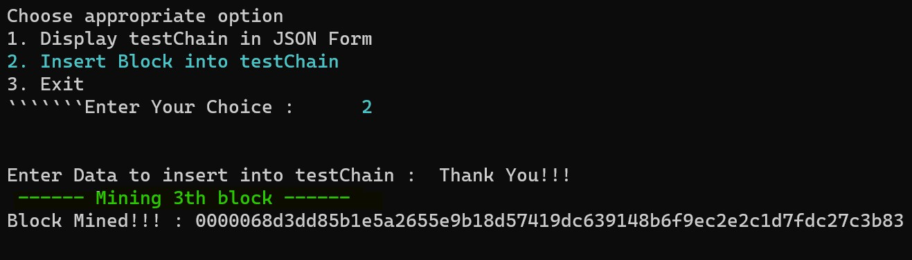

# Project testChain 
Project TestChain can provide a basic understanding of BlockChain.
<br>
[](LICENSE)
<br>


## Index
>1. [Description](https://github.com/malivinayak/testChain/new/main?readme=1#description-)
>2. [Project Working](https://github.com/malivinayak/testChain/new/main?readme=1#project-working-%EF%B8%8F)
>3. [Requirements](https://github.com/malivinayak/testChain/new/main?readme=1#requirements-)
>4. [Installation](https://github.com/malivinayak/testChain/new/main?readme=1#installation-)
>5. [Project Files](https://github.com/malivinayak/testChain/new/main?readme=1#project-files-)
>6. [Compiled .class files](https://github.com/malivinayak/testChain/new/main?readme=1#compiled-class-files-)
>7. [Contributing](https://github.com/malivinayak/testChain/new/main?readme=1#contributing-)
>8. [Thank You!](https://github.com/malivinayak/testChain/new/main?readme=1#thank-you)

## Description 📃
testChain is developed with ```Java``` and Cryptographic algorithm ```SHA256```.
For Calculating ```Hash``` value SHA-256 Algorithm is applied on String containing ```previousHash```, 
```timeStamp``` i.e. minning start time in millisecond, ```data``` and ```miner```. 
Block was mined by setting difficulty level 5 ( It can be changed ).


## Project Working 🕹️
>1. Project testChain
>
>

>2. Options
>
>

> 3. Displaing Empty testChain
>
>

> 4. Adding 1st Block
>
> 

> 5. Displaying testChain
>
> 

> 6. Adding next Block
>
> 

> 7. Adding next Block
>
> 

> 8. Displaying testChain
>
> 

> 9. Exit
>
> 


## Requirements 🔧
 Java version 8 or higher
 
   
## Installation 🔌
1. Press the **Fork** button (top right the page) to save copy of this project on your account.

2. Download the repository files (project) from the download section or clone this project by typing in the bash the following command:

       https://github.com/malivinayak/testChain.git
       
3. Imported it in Intellij IDEA or any other Java IDE.
4. You can compile directly in command line or terminal too.
5. Run the application :D
6. Alternativly [download](https://github.com/malivinayak/testChain/new/main?readme=1#compiled-class-files) 
[.class](https://github.com/malivinayak/testChain/tree/main/class%20files) files and directly run in Command Prompt or Terminal.

## Project files 📂
   - [testChain.java](https://github.com/malivinayak/testChain/blob/main/testChain.java)
   - [Block.java](https://github.com/malivinayak/testChain/blob/main/Block.java)
   - [StringUtil.java](https://github.com/malivinayak/testChain/blob/main/StringUtil.java)
 

## Compiled .class files 📂
>- [x] [testChain⏬](https://github.com/malivinayak/testChain/raw/main/class%20files/testChain.class)
>- [x] [Block⏬](https://github.com/malivinayak/testChain/raw/main/class%20files/Block.class)
>- [x] [StringUtil⏬](https://github.com/malivinayak/testChain/raw/main/class%20files/StringUtil.class)

## Contributing 💡
If you want to contribute to this project and make it better with new ideas, your pull request is very welcomed.
If you find any issue just put it in the repository issue section, thank you.

# Thank You!
Please ⭐️ this repo 
Let me know if you have any suggestions

[ 🔝 ](https://github.com/malivinayak/testChain/new/main?readme=1#project-testchain)
